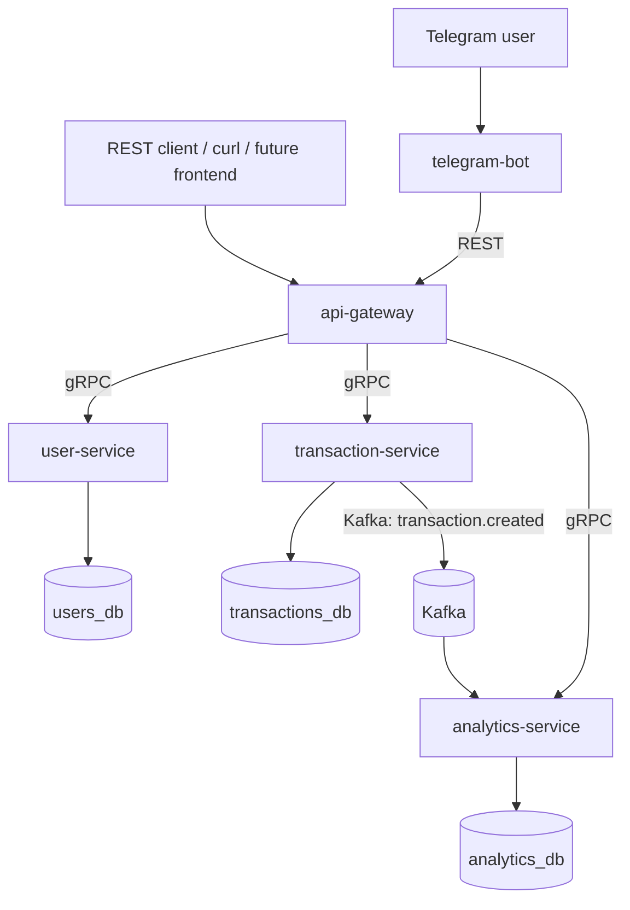

# GoFinTracker

GoFinTracker - учебный микросервисный backend-проект на Go для учета личных финансов.

## Описание Проекта

GoFinTracker позволяет пользователю:

- зарегистрироваться и войти в аккаунт;
- создавать категории доходов и расходов;
- добавлять доходы и расходы;
- смотреть историю операций;
- смотреть баланс;
- получать месячную статистику;
- получать статистику по категориям;
- пользоваться системой через Telegram-бота.

Внешние клиенты работают только через `api-gateway`. Внутренние сервисы общаются по gRPC. `transaction-service` публикует событие `transaction.created` в Kafka, а `analytics-service` строит агрегированную статистику из этих событий.

## Возможности

### Пользователи

- регистрация;
- логин;
- bcrypt-хэширование паролей;
- JWT access token;
- проверка токена через `user-service`.

### Категории

- создание категории;
- список категорий;
- тип категории:
  - `income`;
  - `expense`.

### Операции

- создание дохода;
- создание расхода;
- история операций;
- фильтры истории:
  - период;
  - категория;
  - тип операции;
  - `limit`;
  - `offset`.

### Баланс

- расчет баланса по валютам;
- формула:

```text
balance = income - expense
```

### Аналитика

- месячная статистика;
- статистика по категориям;
- асинхронное обновление через Kafka;
- idempotent обработка событий через `processed_events`.

### Telegram-Бот
@gofintracker_dev_bot
- `/start`;
- `/help`;
- `/register`;
- `/login`;
- `/categories`;
- `/add_category`;
- `/add_expense`;
- `/add_income`;
- `/balance`;
- `/monthly`;
- `/category_stats`.

## Стек Технологий

- Go 1.26
- REST/JSON
- chi
- gRPC
- Protocol Buffers
- PostgreSQL
- pgx
- golang-migrate
- Kafka
- segmentio/kafka-go
- JWT
- bcrypt
- log/slog
- Docker
- Docker Compose
- testing
- GitHub Actions
- Telegram Bot API

## Архитектура

В v1 проект состоит из четырех backend-сервисов и одного внешнего client-сервиса:

- `api-gateway`
  - публичный REST API;
  - JWT middleware;
  - валидация запросов;
  - gRPC-клиенты к внутренним сервисам.

- `user-service`
  - регистрация;
  - логин;
  - хранение пользователей;
  - bcrypt password hashes;
  - выдача JWT;
  - валидация JWT.

- `transaction-service`
  - категории;
  - доходы и расходы;
  - история операций;
  - баланс;
  - публикация события `transaction.created` в Kafka.

- `analytics-service`
  - Kafka consumer;
  - месячные агрегаты;
  - агрегаты по категориям;
  - gRPC API для отчетов.

- `telegram-bot`
  - внешний клиент системы;
  - работает через Telegram Bot API;
  - ходит только в `api-gateway` по REST;
  - не обращается напрямую к gRPC-сервисам или базам данных.



### Данные

Для локальной разработки используется один контейнер PostgreSQL, но отдельная база на сервис:

- `users_db`;
- `transactions_db`;
- `analytics_db`.

Это упрощает локальный запуск, но сохраняет идею ownership данных: каждый сервис владеет своей базой и не читает таблицы другого сервиса напрямую.

### Коммуникации

- REST - внешний API;
- gRPC - синхронные внутренние вызовы;
- Kafka - асинхронные domain events;
- Telegram Bot API - связь Telegram с `telegram-bot`.

## Запуск Через Docker

### 1. Создать `.env`

Для backend-сервисов значения по умолчанию уже подходят для локального запуска.

Для Telegram-бота нужно отдельно указать реальный токен:

```env
TELEGRAM_BOT_TOKEN=your-real-telegram-bot-token
```

### 2. Запустить backend

```bash
docker compose up -d --build
```

Эта команда поднимет:

- PostgreSQL;
- Kafka;
- Kafka UI;
- миграции;
- `user-service`;
- `transaction-service`;
- `analytics-service`;
- `api-gateway`.

`api-gateway` будет доступен на:

```text
http://localhost:8080
```

Kafka UI:

```text
http://localhost:8081
```

### 3. Запустить Telegram-бота

Telegram-бот вынесен в отдельный Docker Compose profile `bot`, чтобы обычный запуск backend не требовал реальный Telegram token.

```bash
docker compose --profile bot up -d telegram-bot
```

### 4. Посмотреть логи

```bash
docker compose logs -f api-gateway
docker compose logs -f user-service
docker compose logs -f transaction-service
docker compose logs -f analytics-service
docker compose logs -f telegram-bot
```

### 5. Остановить проект

```bash
docker compose down
```

## Примеры API Запросов

Ниже пример полного сценария через REST API.

### Healthcheck

```bash
curl -i http://localhost:8080/health
```

### Регистрация

```bash
curl -s -X POST http://localhost:8080/api/v1/auth/register \
  -H "Content-Type: application/json" \
  -d '{"email":"user@example.com","password":"secret123"}'
```

Ответ содержит `access_token`.

Для удобства можно сохранить token:

```bash
TOKEN="paste-access-token-here"
```

### Логин

```bash
curl -s -X POST http://localhost:8080/api/v1/auth/login \
  -H "Content-Type: application/json" \
  -d '{"email":"user@example.com","password":"secret123"}'
```

### Создать Категорию Дохода

```bash
curl -s -X POST http://localhost:8080/api/v1/categories \
  -H "Authorization: Bearer $TOKEN" \
  -H "Content-Type: application/json" \
  -d '{"name":"Salary","type":"income"}'
```

### Создать Категорию Расхода

```bash
curl -s -X POST http://localhost:8080/api/v1/categories \
  -H "Authorization: Bearer $TOKEN" \
  -H "Content-Type: application/json" \
  -d '{"name":"Food","type":"expense"}'
```

### Получить Категории

```bash
curl -s http://localhost:8080/api/v1/categories \
  -H "Authorization: Bearer $TOKEN"
```

### Создать Доход

```bash
curl -s -X POST http://localhost:8080/api/v1/transactions \
  -H "Authorization: Bearer $TOKEN" \
  -H "Content-Type: application/json" \
  -d '{
    "category_id":"salary-category-id",
    "type":"income",
    "amount":100000,
    "currency":"RUB",
    "description":"May salary",
    "occurred_at":"2026-05-31T12:00:00Z"
  }'
```

### Создать Расход

```bash
curl -s -X POST http://localhost:8080/api/v1/transactions \
  -H "Authorization: Bearer $TOKEN" \
  -H "Content-Type: application/json" \
  -d '{
    "category_id":"food-category-id",
    "type":"expense",
    "amount":1500,
    "currency":"RUB",
    "description":"Lunch",
    "occurred_at":"2026-05-31T12:30:00Z"
  }'
```

### История Операций

```bash
curl -s "http://localhost:8080/api/v1/transactions?type=expense&limit=10&offset=0" \
  -H "Authorization: Bearer $TOKEN"
```

### Баланс

```bash
curl -s http://localhost:8080/api/v1/balance \
  -H "Authorization: Bearer $TOKEN"
```

Пример ответа:

```json
{
  "balances": [
    {
      "currency": "RUB",
      "income_amount": 100000,
      "expense_amount": 1500,
      "balance_amount": 98500
    }
  ]
}
```

### Месячная Аналитика

```bash
curl -s "http://localhost:8080/api/v1/analytics/monthly?year=2026&month=5" \
  -H "Authorization: Bearer $TOKEN"
```

### Аналитика По Категориям

```bash
curl -s "http://localhost:8080/api/v1/analytics/categories?year=2026&month=5&type=expense" \
  -H "Authorization: Bearer $TOKEN"
```

Аналитика обновляется асинхронно через Kafka, поэтому сразу после создания операции может быть небольшая задержка.

